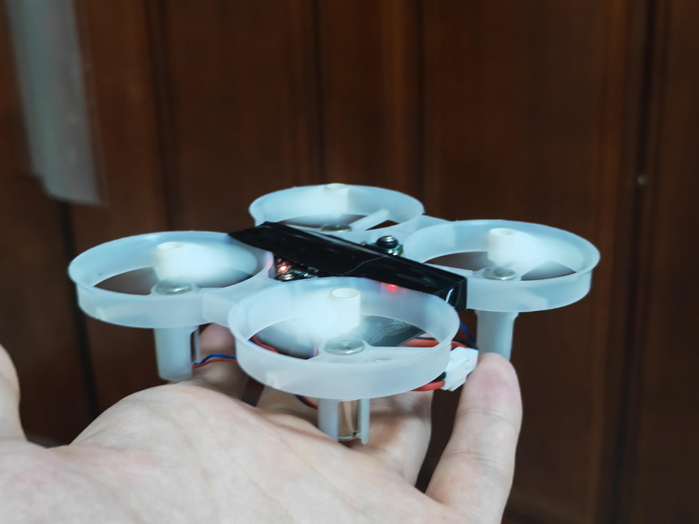

# ESP32_UAV (ESP32-S3 小型四旋翼飞行系统)

基于 ESP-IDF 框架开发的 ESP32-S3 小型四旋翼无人机系统。本仓库包含飞行器与专用遥控器两套独立且完整的开源工程，实现了从底层的传感器驱动、姿态解算，到高阶的 PID 闭环控制与 UI 交互。



## 📁 工程目录结构

项目分为两个独立的 ESP-IDF 应用工程，代码结构模块化，便于二次开发：

### 1. UAV_code (飞行器端)
飞控主程序，负责硬件驱动、高频姿态解算与飞行控制输出。
- **`main/`**：主入口与外设初始化、FreeRTOS 任务调度。
- **`components/flight_control/`**：飞控核心算法库，包含姿态控制（角度/角速度环）、定高/定点（高度/位置环）的 PID 实现及 PWM 动力分配。
- **`components/sensor/` & `IMU/`**：各类传感器驱动及数据滤波（支持 MPU6050、SPL06 气压计、HMC5883L 磁力计、激光及光流传感）。
- **`components/External_communication/`**：提供 Wi-Fi AP 建网与基于定长帧格式的 UDP 双向通信。

### 2. RC_code (遥控器端)
遥控器程序，负责操控输入、UI 渲染与遥测数据展示。
- **`main/`**：遥控器核心逻辑与通信链路建立。
- **`components/lvgl.../`**：集成 LVGL 图形库及 TFT LCD 屏幕驱动。
- **`components/RC_control_signal/`**：ADC 摇杆、实体按键（包含飞行解锁键）的数据采集。
- **`components/External_communication/`**：以 STA 模式接入飞控网络，进行状态展示及指令下发。

## ✨ 核心特性

- **多种飞行模式**：支持基础手动自稳、依赖气压与测距的定高、融合光流的定点模式切换。
- **起停保护机制**：独立物理按键防误触解锁；具备大倾角锁桨保护（横滚/俯仰>45°自动切断动力，防止侧翻打桨）。
- **局域互联机制**：
  - **飞控组网**：固定 AP 热点 (`ESP-UAV` / 密码 `12345678`)，默认 IP `192.168.43.42`。
  - **通信链路**：UDP `5555` 端口进行双向遥测数据同步；同时保留 UDP `3333` 端口接入“匿名科创 Ano TC”上位机，进行实波追踪及 PID 调参。
- **极简硬件选型**：使用 8520 空心杯电机、1S (3.7V) 锂电池直接供电；搭配外围 LED 提供快速的状态自检。


## 🚀 快速上手 (编译与运行)

### 环境与依赖
- 建议使用官方原生 **ESP-IDF V4.4.x / V5.x** 开发环境。
- 请检查并确保工程克隆路径中 **不包含任何中文、特殊字符或空格**。

### 编译指令

因两套工程完全隔离，请分别开启终端并切入对应目录进行编译及烧录：

```bash
# ----- 1. 飞行器代码固件编译 -----
cd UAV_code
idf.py set-target esp32s3
idf.py build
# 请确认核心板未接入高压后烧录
idf.py -p COMx flash monitor

# ----- 2. 遥控器代码固件编译 -----
cd ../RC_code
idf.py set-target esp32s3
idf.py build
idf.py -p COMx flash monitor
```

> **⚠️ 串口接线安全警告**：脱机使用 USB 转 TTL 串口线烧录核心板时，**模块及供电引脚必须严格接 3.3V，严禁短接 5V 导致芯片击穿损毁**！若系统未自动复位进入下载状态，需手动强行操作：一直按住 `BOOT` 键 → 点按一次 `RST` 并松开 → 松开 `BOOT` 键。

### 运行引导
1. **飞控端就绪**：将 `UAV_code` 机架板独立供电，自检完成亮起蓝灯，即代表 AP 建立完成。
2. **屏显互联**：给 `RC_code` 遥控器上电，屏幕初始化并自动连入热点网络，即可呈现回传的姿态变量。
3. **解锁起飞**：推动起飞按键（按压左上侧实体按键产生解锁上升沿），电机待命，此时推摇杆即可起飞。

